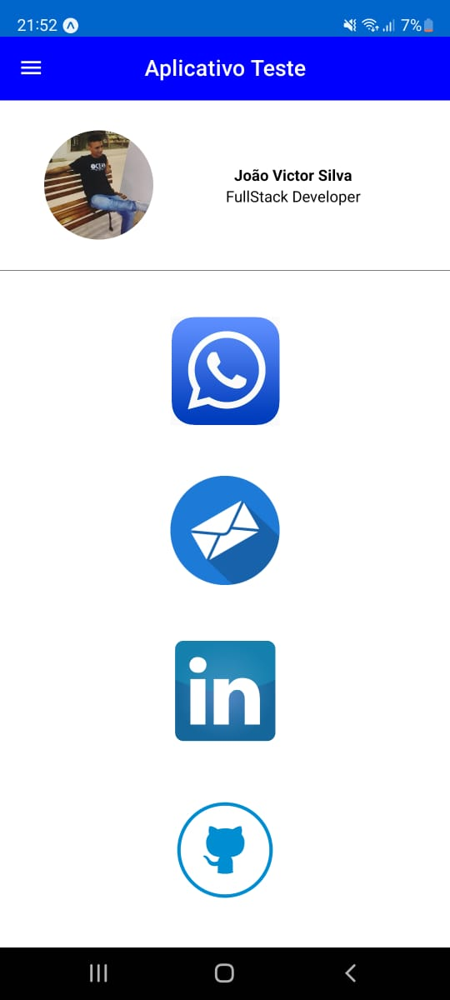
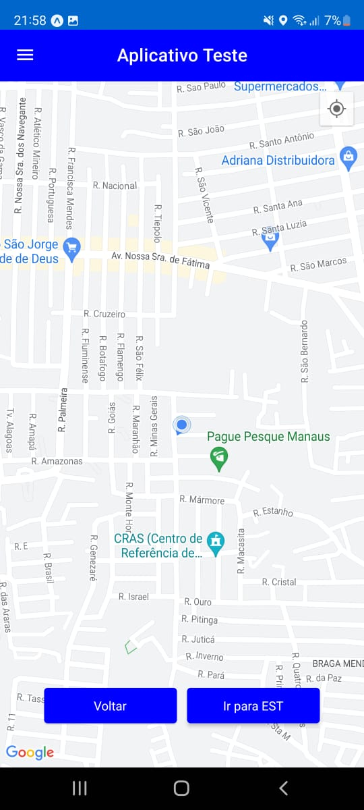
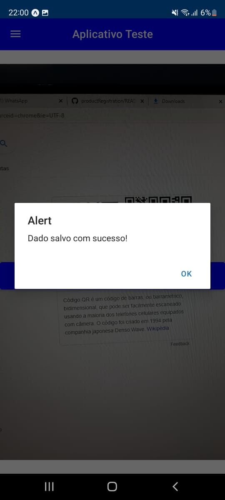
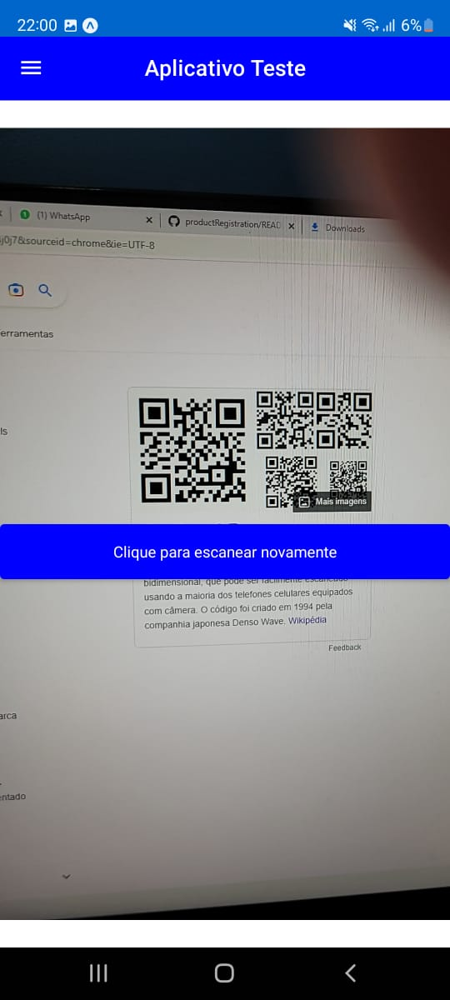
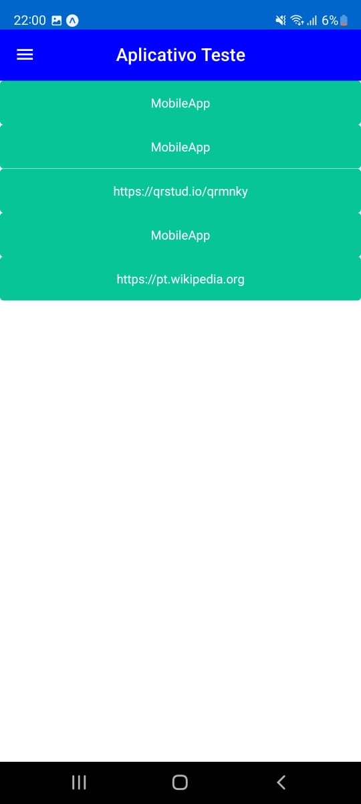
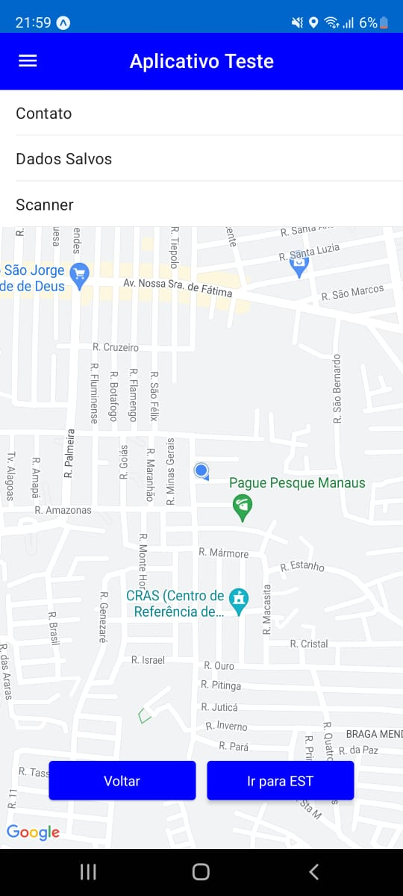

# React Native - First App

Here I had my first application created in React Native, initially I did it with the intention of being selected for an R&D project. I ended up studying the library and ended up falling in love.

## 1. About the project

The project was created purely with ReactNative, with the aid of material design to build the screens.

In this project, we have an application that has some features, such as: integration with Google Maps, qrcode reading saving the data read and contact data with the developer.

## 2. Instructions for running the project.

### Frontend

To run Frontend, follow the steps below:

### 2.1 Project Configuration

Initially, you must have `node` installed on your machine, in order to install the dependencies and run the project. To install the node, just click on the following link:
https://nodejs.org/.

Another thing you must have is a cell phone, which can be any operating system, and it must have the Expo application.

If you are using an android phone, you can download it from the following link: https://play.google.com/store/apps/details?id=host.exp.exponent&hl=pt_BR&gl=US&pli=1

If you are using an ios mobile phone, you can download it from the following link: https://apps.apple.com/br/app/expo-go/id982107779


### 2.2 Installing project dependencies

Open the project in the `root` folder.

Install project dependencies with: `npm install`

```sh
npm install
```

After that the project is set up successfully

### 2.3 Project Execution

Run the npx expo start command in the terminal, with that a Qr Code will be displayed in the terminal, and just use the `Expo` application on your cell phone and read it, with that the program will be executed.

```sh
npx expo start
```

## 3. Results

### 3.1 Contact Screen

Initially, when entering the app, it opens on the contact screen with the developer, on this screen there are several links on some social networks, such as Whatsapp, E-mail, Linkedin and GitHub.



### 3.2 Google Maps Screen

On the integration screen with Google Maps, the user's initial location is displayed and on this map screen, there are two buttons, one to return to the application's home and another for the map to take you to the headquarters of the Superior School of Technology - State University of Amazonas.



### 3.3 Qr Code Read Screen

Now on the QR Code reading screen, just point the cell phone camera at a code that will be read automatically, and an alert will be displayed confirming that the reading was successful, with that the previously read QR Code data is stored in the cell phone's own memory storage.






### 3.4 History Qr Codes Readed

On the read Qr Codes history screen, it is basically a list of all saved codes.



### 3.5 App Bar

To transition between screens, I'm using a simple App Bar, with a list of all available screens.

